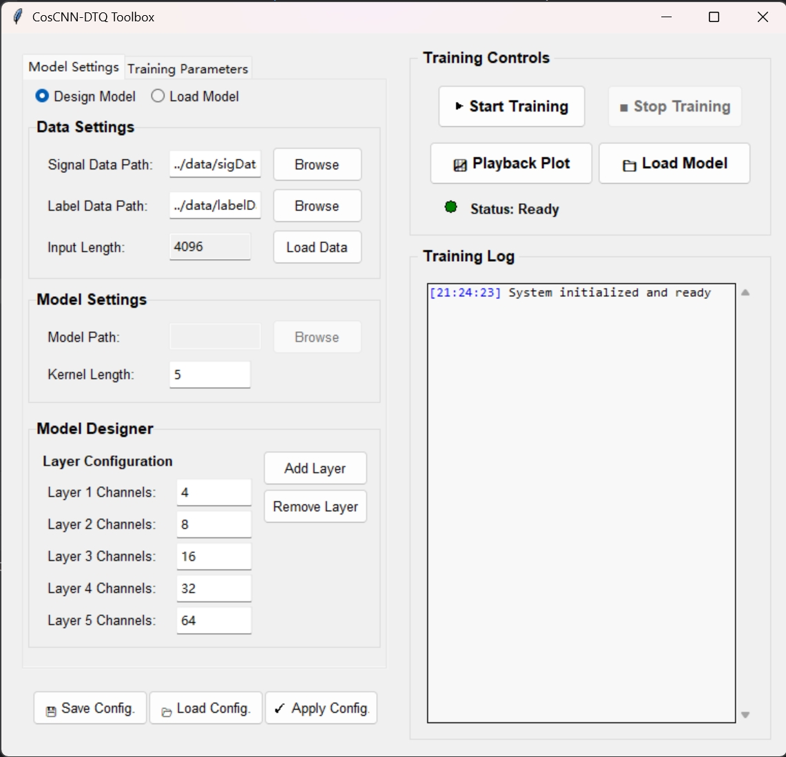

# EpiCosCNN-Meta

## Welcome! 
This project provides an open-source, interactive platform for end-to-end deep learning analysis of EEG data. It is built upon the brainda framework and features a powerful Graphical User Interface (GUI) to streamline the entire experimental workflow, from data processing to model training and real-time visualization.

While the platform is designed to be flexible, its core application focuses on a high-performance Cosine-similarity-based Convolutional Neural Network (CosCNN) for epilepsy detection, achieving state-of-the-art results on standard benchmarks. The project is designed to bridge the gap between complex deep learning algorithms and intuitive, interactive applications for researchers.

## Overall Effect
After running the program, the graphical interface starts successfully. Users can smoothly use the interface controls to complete a series of operations, including model configuration, loading/saving settings, initiating training, monitoring logs, and viewing the confusion matrix. The entire interaction process is stable and functions as designed.



## Citation

Mei, J., Luo, R., Xu, L., Zhao, W., Wen, S., Wang, K., ... & Ming, D. (2023). MetaBCI: An open-source platform for brain-computer interfaces. Computers in Biology and Medicine, 107806.

G. Liu, L. Tian, Y. Wen, W. Yu, W. Zhou, "Cosine Convolutional Neural Network and Its Application for Seizure Detection," Neural Networks, 2024.

G. Liu, S. Ren, J. Wang, W. Zhou, "Efficient Group Cosine Convolutional Neural Network for EEG-based Seizure Identification," IEEE Transactions on Instrumentation and Measurement, 2025.

beginner-git, "CosCNN-DTQ-Toolbox," 2021. Accessed: Jul. 10, 2025. [Software]. Available: https://github.com/beginner-git/CosCNN-DTQ-Toolbox.


## Content

- [EpiCosCNN-Meta](#epicoscnn-meta)
  - [Welcome!](#welcome)
  - [Overall Effect](#overall-effect)
  - [Citation](#citation)
  - [Content](#content)
  - [What are we doing?](#what-are-we-doing)
    - [The problem](#the-problem)
    - [The solution](#the-solution)
  - [Features](#features)
  - [Installation](#installation)
  - [License](#license)
  - [Contact](#contact)

## What are we doing?

### The problem

* High Barrier to Entry: Setting up a complete deep learning pipeline for EEG analysis is complex and time-consuming, requiring significant effort in data handling, model implementation, and experiment management.
* Gap Between Algorithm and Application: Researchers often develop powerful algorithms, but applying them in an interactive, visual manner for analysis or real-time feedback is a separate, significant engineering challenge.
* GUI Performance Bottlenecks: Real-time visualization and model inference can easily block the main thread of a graphical application, leading to a frozen, unresponsive user interface.
* Repetitive Workflow: Manually configuring experiments, training models, and evaluating results through scripts can be tedious and prone to error.

### The solution

This platform is designed to solve these problems by providing:

* An intuitive GUI "cockpit" that allows users to visually design models, configure parameters, monitor training, and analyze results, significantly simplifying the experimental workflow.
* A standardized data pipeline that leverages brainda to process raw EEG datasets (like the Bonn database) into clean, ready-to-use JSON files.
* A high-performance architecture that uses a PredictionWorker (extending brainflow's ProcessWorker) to offload model inference to a background process, ensuring the GUI remains smooth and responsive.
* A flexible model integration layer that not only features the highly optimized CosCNN but also allows for easy integration of other architectures (e.g., EEGNet, Deep4Net, ShallowNet) through a CustomModel adapter pattern.

The goal is to empower researchers to focus on developing and testing novel algorithms without getting bogged down in repetitive engineering tasks.

## Features

* End-to-End Interactive Workflow: A complete solution from raw data processing to advanced model training, evaluation, and visualization.
* High-Performance CosCNN Model: Includes a deeply integrated Cosine Convolutional Network (CosCNN) that achieves up to 98.4% accuracy on the Bonn epilepsy dataset.
* Intuitive GUI for Experimentation: Visually configure all aspects of the training process, monitor metrics in real-time, and observe predictions on single samples.
* Flexible Model Integration: Easily swap or add new deep learning models using a lazy-initialized adapter pattern. Support for architectures like EEGNet, Deep4Net, and ShallowNet is built-in.
* Non-Blocking Real-Time Prediction: Ensures a smooth and responsive UI during computationally intensive tasks thanks to a dedicated background worker process.

## Installation

1. Clone the repo
   ```sh
   git clone https://github.com/beginner-git/MetaBCI
   ```
2. Change to the project directory
   ```sh
   cd MetaBCI
   ```
3. Install all requirements
   ```sh
   pip install -r requirements.txt 
   ```
4. Install brainda package with the editable mode
   ```sh
   pip install -e .
   ```

## License

Distributed under the GNU General Public License v2.0 License. See `LICENSE` for more information.

## Contact

If there is any technical issue, please contact the corresponding author Guoyang Liu: gyliu@sdu.edu.cn (please also cc virter1995@outlook.com) Visit http://guoyang.work/ for more related works.
